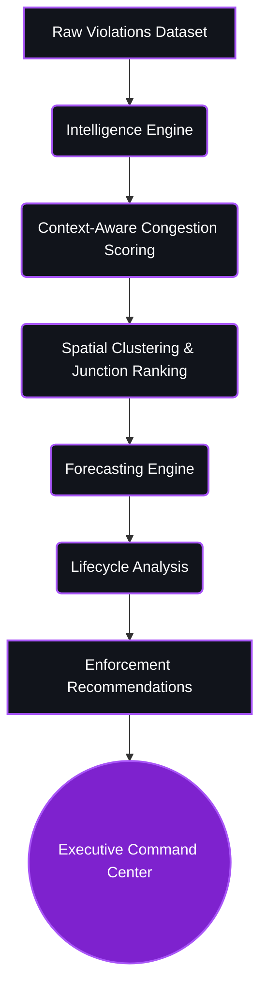

# 🚦 SmartPark AI


**SmartPark AI** is an AI-powered Parking Congestion Intelligence Platform. It ingests historical parking violation data and applies sophisticated spatial, temporal, and machine learning analytics to transform raw datasets into actionable enforcement intelligence.

---

## 🛑 Problem Statement

**Poor Visibility on Parking-Induced Congestion**

Modern cities suffer from crippling traffic gridlock, much of which is directly caused by illegal parking near critical infrastructure (hospitals, bus stops, main roads). While cities have raw data on parking violations, they lack context. A scooter parked on a side street is treated identically to a tanker truck double-parked on a main arterial road.

**How can AI-driven parking intelligence detect illegal parking hotspots and quantify their impact on traffic flow to enable targeted enforcement?**

SmartPark AI solves this by introducing context-aware congestion scoring, spatial clustering, and predictive forecasting to tell authorities exactly *where* to go, *when* to go, and *who* to deploy.

---

## 💡 Solution Overview

SmartPark AI processes raw parking violations through a multi-stage intelligence pipeline, converting isolated data points into operational dispatch commands.



---

## ✨ Key Features

| Feature | Description |
| :--- | :--- |
| 📊 **Enhanced Congestion Scoring** | Evaluates true congestion impact by weighting vehicle size (e.g., scooter vs. tanker) against the severity of the violation (e.g., wrong parking vs. double parking). |
| 🗺️ **Geospatial Intelligence** | Utilizes Haversine DBSCAN clustering to dynamically map dense illegal parking hotspots across city infrastructure. |
| 🚦 **Junction Risk Intelligence** | Ranks specific junctions based on cumulative risk, factoring in violation volume, congestion severity, and historical approval rates. |
| 🔮 **Predictive Forecasting** | Employs temporal modeling to estimate future congestion conditions and violation volumes hour-by-hour. |
| 🧬 **Hotspot Lifecycle Intelligence** | Categorizes junctions as *Emerging*, *Growing*, *Persistent*, or *Critical* to understand the maturity and trend of illegal parking activity. |
| 🚨 **Enforcement Recommendation Engine** | An explainable, rule-based dispatch system that triggers actionable alerts like *Immediate Towing*, *Emergency Enforcement*, or *Scheduled Patrols*. |
| 🖥️ **Executive Command Center** | A dark-mode, premium operational dashboard designed for city authorities and dispatch units. |

---

## 🏛️ System Architecture

```mermaid
flowchart LR
    subgraph Data Layer
        A[(Bengaluru Parking Dataset)]
    end

    subgraph Backend Core [FastAPI Service]
        B[ETL Pipeline]
        C[Haversine DBSCAN Clustering]
        D[Temporal Feature Extraction]
        
        B --> C
        C --> D
        
        subgraph Analytics Engines
            E[Junction Risk Engine]
            F[Predictive Forecasting Engine]
            G[Hotspot Lifecycle Engine]
            H[Enforcement Engine]
            
            D --> E
            D --> F
            D --> G
            E --> H
            F --> H
            G --> H
        end
    end

    subgraph REST APIs
        I[/api/junctions]
        J[/api/forecast]
        K[/api/lifecycle]
        L[/api/enforcement]
        
        E --> I
        F --> J
        G --> K
        H --> L
    end

    subgraph Frontend Client [Next.js]
        M[Executive Command Center]
        N[Violations Map]
        
        I --> M
        J --> M
        K --> M
        L --> M
    end

    A --> B
    
    classDef layer fill:#1a1f2c,stroke:#374151,stroke-width:2px,color:#fff;
    class A,B,C,D,E,F,G,H layer;
```

---

## 🧠 Intelligence Pipeline

SmartPark AI is built upon five foundational analytics pipelines:

1. **Enhanced Congestion Scoring:** Calculates a `violation_severity_score` and a `vehicle_impact_score`. Double-parking a tanker produces an exponentially higher congestion score than incorrectly parking a scooter.
2. **Haversine Clustering:** Replaces standard Euclidean distance with Haversine distance in DBSCAN, mapping longitude and latitude in radians to accurately cluster physical world proximity.
3. **Junction Risk Ranking:** Calculates `risk_score = avg_enhanced_congestion * log1p(total_violations) * approval_rate` to deterministically rank city junctions by severity.
4. **Forecasting:** Splits `created_datetime` into hourly and daily bins to normalize historical frequencies. Generates a future `forecast_score` with an associated confidence metric.
5. **Lifecycle Classification:** Tracks temporal trends. An active junction with increasing volume over a short time is `Emerging`; high risk over a long time is `Persistent`; top-percentile risk is `Critical`.
6. **Enforcement Recommendation Engine:** Cross-references the outputs of Risk, Forecast, and Lifecycle engines to output strict dispatch commands, ensuring highly defensible, explainable AI recommendations free from black-box unpredictability.

---

## 🖥️ Executive Command Center

The primary user interface is a unified dashboard designed for city authorities. 

It provides:
- **KPIs:** Instant metrics on Total Violations, Active Hotspots, Critical Junctions, and Predicted Critical Junctions.
- **Risk Intelligence:** Ranked tables of the city's highest-risk intersections.
- **Forecast Intelligence:** 1-to-3 hour future predictions of where gridlock will happen before it occurs.
- **Lifecycle Intelligence:** Categorical distributions of the city's hotspots tracking their progression from Emerging to Critical.
- **Enforcement Actions:** A highly visual "Top 10 Dispatch Targets" table that dictates exactly where units should deploy, down to Priority 1 `Immediate Towing` mandates.

---

## 🛠️ Technology Stack

| Domain | Technologies |
| :--- | :--- |
| **Frontend** | React, Next.js, Tailwind CSS, Recharts, Leaflet |
| **Backend** | Python, FastAPI, Uvicorn |
| **Data Science** | Pandas, NumPy, Scikit-learn (DBSCAN) |
| **Visualization** | Dynamic Heatmaps, Time-Series Area Charts |
| **Deployment** | Render (Backend), Vercel/Netlify (Frontend) |

---

## 🔌 API Endpoints

### `GET /api/dashboard-summary`
Returns high-level system KPIs.

### `GET /api/heatmap-data?hours_ahead=X`
Returns Haversine-clustered latitude and longitude weights. Pass `hours_ahead` for temporal forecasting.

### `GET /api/junctions`
Returns the Top 20 highest-risk junctions based on the Junction Risk Engine.
```json
[
  {
    "junction_name": "MG Road Crossing",
    "total_violations": 152,
    "avg_congestion": 84.5,
    "approval_rate": 0.98,
    "risk_score": 424.3,
    "risk_tier": "Critical",
    "recommended_action": "Immediate Enforcement"
  }
]
```

### `GET /api/forecast?hours_ahead=1`
Returns predictive analytics for future traffic gridlock.
```json
[
  {
    "junction_name": "Koramangala 100ft",
    "forecast_score": 87.2,
    "confidence_score": 92.0,
    "expected_congestion": 84.0,
    "expected_violation_volume": 43.5,
    "predicted_risk_tier": "Critical"
  }
]
```

### `GET /api/lifecycle`
Returns temporal classification of hotspots.
```json
[
  {
    "junction_name": "Silk Board Junction",
    "lifecycle_stage": "Growing",
    "risk_score": 218,
    "trend_direction": "Increasing",
    "total_violations": 152,
    "active_weeks": 18
  }
]
```

### `GET /api/enforcement`
Returns deterministic dispatch recommendations prioritized for city authorities.
```json
[
  {
    "junction_name": "MG Road Crossing",
    "risk_tier": "Critical",
    "forecast_score": 85.0,
    "lifecycle_stage": "Critical",
    "recommended_action": "Immediate Towing",
    "priority_level": 1,
    "reason": "Severe congestion, persistent critical hotspot, and high future forecast."
  }
]
```

---

## 📂 Project Structure

```text
SmartPark-AI-main/
├── backend/
│   ├── app/
│   │   ├── main.py              # FastAPI application & route definitions
│   │   ├── process_csv.py       # Core analytics & intelligence engines
│   │   └── data/
│   │       └── dataset.csv      # Raw violation records
│   ├── requirements.txt
│   └── run.sh
└── frontend/
    ├── src/
    │   ├── app/
    │   │   ├── page.tsx         # Executive Command Center
    │   │   ├── layout.tsx
    │   │   └── map/
    │   │       └── page.tsx     # Violations Map Dashboard
    │   └── components/
    │       ├── HeatMap.tsx      # Geospatial Leaflet component
    │       └── Map.tsx
    ├── package.json
    └── tailwind.config.ts
```

---

## 🚀 Local Setup

### 1. Backend Setup

Navigate to the backend directory and install dependencies:
```bash
cd backend
pip install -r requirements.txt
```

Start the FastAPI server:
```bash
uvicorn app.main:app --host 127.0.0.1 --port 8000 --reload
```

### 2. Frontend Setup

Navigate to the frontend directory and install dependencies:
```bash
cd frontend
npm install
```

Start the Next.js development server:
```bash
npm run dev
```

### 3. Run Instructions
Access the Executive Command Center by navigating to `http://localhost:3000` in your browser. The frontend is configured to automatically fetch data from the local backend running on port `8000`.

---

## 🔭 Future Scope

* **Real CCTV Integration:** Integrating direct computer vision pipelines into existing city surveillance infrastructure.
* **YOLO Edge Deployment:** Deploying YOLOv8 models onto edge computing hardware installed at critical traffic junctions for latency-free detection.
* **Real-time Streams:** Upgrading from batched historical analysis to Apache Kafka event streams for sub-second enforcement deployment.
* **Smart City Integration:** Exporting data hooks directly into metropolitan dispatch routing algorithms.

---

## 👥 Team

Built with ❤️ for the Hackathon.

---

## 📄 License

This project is licensed under the MIT License.